# SpartaFlow — Database Design

> Design document only. **No code or migration was written; the application was
> not modified.** This is the target Supabase/PostgreSQL schema derived from
> `CLAUDE.md`, `docs/ARCHITECTURE.md`, `docs/BACKEND_MIGRATION_PLAN.md`, the
> feature `types.ts` files, and the **existing** migrations in
> `supabase/migrations/`.
> Snapshot date: 2026-06-30.

## Conventions (inherited from existing migrations)

These rules are already established by the live `auth` + `attendance` schema and
**every new table must follow them**:

- **Primary keys**: `uuid PRIMARY KEY DEFAULT gen_random_uuid()` (except the
  `company_settings` singleton, keyed `boolean = true`). Per CLAUDE.md "Use UUIDs".
- **Timestamps**: `created_at timestamptz NOT NULL DEFAULT now()` and, where rows
  mutate, `updated_at timestamptz NOT NULL DEFAULT now()` maintained by the
  existing `public.tg_set_updated_at()` BEFORE-UPDATE trigger.
- **Identity FKs**: user references point at `auth.users(id)` (mirrored 1:1 by
  `public.profiles`). `ON DELETE CASCADE` for owned rows, `ON DELETE SET NULL` for
  soft references (actor/granted_by).
- **RLS**: `ENABLE ROW LEVEL SECURITY` on every table (CLAUDE.md "Use RLS").
  Authorization helpers already exist and are `SECURITY DEFINER`, `search_path =
  public`, execute revoked from `anon`:
  - `public.has_role(uid, role)` · `public.has_any_role(uid, role[])` ·
    `public.current_user_roles()`.
- **Grants**: `GRANT SELECT[, INSERT, UPDATE, DELETE] … TO authenticated;
  GRANT ALL … TO service_role;` Never grant to `anon`.
- **Controlled mutation**: tables whose writes must be validated/atomic (attendance,
  timers, report submission, dependency state) expose **`SECURITY DEFINER` RPC
  functions** instead of direct INSERT/UPDATE grants — the pattern set by
  `start_work_session` / `finish_work_session`.
- **Denormalize `user_id`** onto child rows where it makes an RLS check cheap
  (as `work_session_breaks.user_id` already does).
- **Soft delete** via `deleted_at timestamptz` / `archived_at timestamptz`; never
  hard-delete user content.
- **Realtime**: add live-collaboration tables to `supabase_realtime` publication
  (as `work_sessions` already is).
- **Derived numbers are views, not columns** (project progress, sprint burndown,
  analytics) — see §20.

### Legend
✅ exists today · 🆕 new table · 🔁 extend existing table.

---

## Enum Types

Existing: `app_role`, `employee_status`, `attendance_status`, `work_session_status`.

New enums to add:

```
permission_key   : users:read, users:write, roles:write, hr:access, owner:access,
                   reports:read, reports:write, projects:write, tasks:write
project_status   : planning, active, on_hold, completed, archived, cancelled
project_health   : healthy, at_risk, blocked, delayed, completed
priority_level   : low, medium, high, critical          -- shared by projects/tasks/deps
project_role     : lead, contributor, reviewer, stakeholder
task_status      : backlog, todo, in_progress, review, qa, done, blocked, cancelled
task_relation    : blocks, blocked_by, relates_to, duplicates
sprint_status    : planned, active, completed
time_log_source  : timer, manual
report_type      : checkin, midday, eod
dependency_state : draft, pending, accepted, in_progress, blocked, resolved,
                   rejected, cancelled, closed
dependency_type  : backend_api, ui_design, frontend, qa, devops, database, content,
                   product_decision, client_feedback, bug_fix, infrastructure,
                   security, other
comment_parent   : task, dependency, project          -- polymorphic comment target
attachment_owner : task, project, comment, hr_document, avatar
notification_type     : info, success, warning, critical, reminder
notification_priority : low, normal, high, critical
notification_state    : unseen, seen, read, dismissed, archived
delivery_channel      : in_app, email, slack, push
audit_action     : create, update, delete, status_change, role_grant, role_revoke,
                   login, invite, approve, reject, export
```

---

# 1. Authentication — `auth.users` ✅ (Supabase-managed)

Owned by Supabase Auth; **not created by us**. The trigger `handle_new_user()`
already auto-provisions a `profiles` row + default `employee` role on signup, and
`handle_user_email_confirmed()` flips status `invited → active`.

- **PK**: `id uuid` (Supabase).
- **FKs**: referenced by `profiles.id`, `user_roles.user_id`, and every
  `*_by` / `user_id` column below.
- **RLS**: managed by Supabase; never exposed directly to the client.

---

# 2. Profiles — `public.profiles` ✅ (exists)

1:1 with `auth.users`. The canonical "person" record; the mock `HrEmployee`
should map onto this + the `employment` extension (§5), **not** a parallel table.

| Column | Type | Notes |
| --- | --- | --- |
| id | uuid PK | → `auth.users(id)` ON DELETE CASCADE |
| email | text NOT NULL UNIQUE | |
| full_name / display_name | text | |
| avatar_url | text | Storage `avatars` bucket |
| job_title | text | |
| department_id | uuid | → `departments(id)` SET NULL |
| team_id | uuid | → `teams(id)` SET NULL |
| status | employee_status | default `invited` |
| timezone / locale | text | |
| last_seen_at | timestamptz | |
| created_at / updated_at | timestamptz | trigger-maintained |

- **Indexes** (exist): `(department_id)`, `(team_id)`, `(status)`.
- **RLS** (exists): read all non-offboarded (`profile_read_directory`); self-update
  (`profile_self_update`); HR/super_admin/owner update any (`profile_admin_update`).

---

# 3. Roles — `public.user_roles` ✅ (exists)

Roles are stored **separately from profiles** (deliberate — prevents privilege
escalation via profile self-update).

| Column | Type | Notes |
| --- | --- | --- |
| id | uuid PK | |
| user_id | uuid NOT NULL | → `auth.users(id)` CASCADE |
| role | app_role NOT NULL | |
| granted_by | uuid | → `auth.users(id)` SET NULL |
| granted_at | timestamptz | |
| | | UNIQUE `(user_id, role)` |

- **Index** (exists): `(user_id)`.
- **RLS** (exists): self or HR/admin read (`roles_self_read`); only
  super_admin/owner write (`roles_admin_write`).

---

# 4. Permissions — `public.role_permissions` 🆕

Moves the frontend `permissions.ts` matrix into the DB as the single source of
truth, so UI gating and RLS derive from the same table (closes audit finding on
matrix drift). Seeded, rarely mutated.

| Column | Type | Notes |
| --- | --- | --- |
| role | app_role NOT NULL | composite PK |
| permission | permission_key NOT NULL | composite PK |
| | | PK `(role, permission)` |

- **Index**: PK covers lookups; add `(role)` for "permissions for role".
- **Helper RPC**: `public.has_permission(uid, permission_key)` (SECURITY DEFINER) —
  `EXISTS (… user_roles JOIN role_permissions …)`.
- **RLS**: read for all `authenticated`; write only `owner`/`super_admin`.
- **Seed** (from `permissions.ts`): owner → all; super_admin → all except
  `owner:access`; hr → users:read/write, hr:access, reports:read; project_manager /
  team_lead → users:read, reports:read/write; employee → users:read, reports:write;
  viewer → users:read, reports:read.

---

# 5. Employees — `public.employment` 🆕 (extends Profiles)

HR/employment facts that don't belong on the lightweight `profiles` record.
One row per employee (PK = profile id), keeping the directory in `profiles`.

| Column | Type | Notes |
| --- | --- | --- |
| profile_id | uuid PK | → `profiles(id)` CASCADE |
| employee_code | text UNIQUE | e.g. `EMP-014` |
| manager_id | uuid | → `profiles(id)` SET NULL (reporting line) |
| employment_type | text | full_time / contractor / intern |
| hire_date | date | |
| birth_date | date | drives birthday widgets |
| end_date | date | offboarding |
| work_location | text | remote / city |
| created_at / updated_at | timestamptz | trigger |

- **Indexes**: `(manager_id)`, `(hire_date)`, `(birth_date)`.
- **RLS**: self read own; manager reads reports; HR/super_admin/owner read+write all.

> Company-Hub satellites (`leave_requests`, `leave_balances`, `announcements`,
> `documents`, `onboarding_tasks`, `offboarding_tasks`, `invitations`) follow the
> same patterns; tracked in `BACKEND_MIGRATION_PLAN.md §4`. Documents use the
> unified `attachments` table (§12).

---

# 6. Departments — `public.departments` ✅ / `public.teams` ✅ (exist)

| departments | Type | | teams | Type |
| --- | --- | --- | --- | --- |
| id | uuid PK | | id | uuid PK |
| name | text UNIQUE | | department_id | uuid → departments SET NULL |
| slug | text UNIQUE | | name | text |
| created/updated_at | timestamptz | | slug | text UNIQUE |

- **RLS** (exists): read for all authenticated; write HR/super_admin/owner.

---

# 7. Attendance — `public.work_sessions` ✅ + `public.work_session_breaks` ✅ (exist)

One session per `(user_id, work_date)`; all transitions via SECURITY DEFINER RPCs
(`start_work_session`, `start_break`, `end_break`, `finish_work_session`,
`current_work_date`). Supporting singletons `company_settings` ✅ (see §19) and
`holidays` ✅.

| work_sessions (key cols) | Type |
| --- | --- |
| id | uuid PK |
| user_id | uuid NOT NULL (→ auth.users) |
| work_date | date NOT NULL |
| started_at / finished_at | timestamptz |
| session_status | work_session_status |
| attendance_status | attendance_status |
| late_minutes / working_seconds / break_seconds / overtime_seconds | int |
| device / browser / ip / location / timezone / notes | text |
| | UNIQUE `(user_id, work_date)` |

- **Indexes** (exist): `(user_id, work_date DESC)`, `(work_date DESC)`, partial
  `(session_status) WHERE status IN ('working','on_break')`.
- **RLS** (exists): self read; managers/HR/owner read all; **no direct writes**.
- **Realtime** (exists): both tables in `supabase_realtime`.

---

# 8. Projects — `public.projects` 🆕 (P0 root entity)

| Column | Type | Notes |
| --- | --- | --- |
| id | uuid PK | |
| key | text NOT NULL UNIQUE | e.g. `ETB` — drives task refs |
| name | text NOT NULL | |
| description | text | |
| client_id | uuid | → `clients(id)` SET NULL |
| manager_id | uuid NOT NULL | → `profiles(id)` |
| department_id | uuid | → `departments(id)` SET NULL |
| priority | priority_level | default `medium` |
| status | project_status | default `planning` |
| health | project_health | default `healthy` |
| start_date / end_date | date | |
| color / icon | text | |
| repository_url / figma_url / api_docs_url | text | |
| environments | jsonb | `[{label,url}]` |
| template_id | uuid | → `project_templates(id)` SET NULL |
| favorite | boolean | (per-user favorite better as join — see note) |
| archived_at / created_at / updated_at | timestamptz | |

- **Indexes**: `(status)`, `(manager_id)`, `(client_id)`, `(department_id)`,
  `(key)` unique, partial `(archived_at) WHERE archived_at IS NULL`.
- **Derived**: progress / openTasks / overdue / totalTasks come from the
  `project_stats` view (§20), **not stored**.
- **Supporting tables** (same conventions): `clients`, `project_templates`,
  `milestones (project_id, name, due_date, status, progress)`,
  `project_activity (project_id, actor_id, type, summary, at)`, and
  `project_favorites (project_id, user_id)` for the per-user favorite flag.
- **RLS**: read if member OR has `projects:write`/manager+ roles; write if
  `manager_id = auth.uid()` OR `has_any_role(owner, super_admin, project_manager)`.

---

# 9. Project Members — `public.project_members` 🆕

| Column | Type | Notes |
| --- | --- | --- |
| id | uuid PK | |
| project_id | uuid NOT NULL | → `projects(id)` CASCADE |
| user_id | uuid NOT NULL | → `profiles(id)` CASCADE |
| project_role | project_role NOT NULL | default `contributor` |
| added_by | uuid | → profiles SET NULL |
| created_at | timestamptz | |
| | | UNIQUE `(project_id, user_id)` |

- **Indexes**: `(project_id)`, `(user_id)`.
- **Helper**: `public.is_project_member(uid, project_id)` SECURITY DEFINER —
  reused by tasks/sprints/comments RLS.
- **RLS**: members read their project's membership; project manager/lead + admins
  write.

---

# 10. Tasks — `public.tasks` 🆕 (P0, highest fan-out)

Subtasks are tasks with non-null `parent_task_id` (self-referential), per the
type doc.

| Column | Type | Notes |
| --- | --- | --- |
| id | uuid PK | |
| ref | text NOT NULL UNIQUE | `ETB-142`, from `next_task_ref(project_key)` RPC |
| project_id | uuid NOT NULL | → `projects(id)` CASCADE |
| parent_task_id | uuid | → `tasks(id)` CASCADE (subtask tree) |
| epic_id | uuid | → `epics(id)` SET NULL |
| milestone_id | uuid | → `task_milestones(id)` SET NULL |
| sprint_id | uuid | → `sprints(id)` SET NULL |
| title | text NOT NULL | |
| description | text | markdown |
| status | task_status | default `todo` |
| priority | priority_level | default `medium` |
| labels | text[] | small fixed vocab |
| assignee_id | uuid | → profiles SET NULL |
| reporter_id | uuid NOT NULL | → profiles |
| start_date / due_date | date | |
| estimated_hours / story_points | numeric | |
| completed_at / archived_at / deleted_at | timestamptz | soft states |
| created_at / updated_at | timestamptz | |

- **Indexes**: `(project_id)`, `(assignee_id)`, `(status)`, `(sprint_id)`,
  `(parent_task_id)`, `(due_date)`, partial `WHERE deleted_at IS NULL`; GIN on
  `labels`; optional GIN trigram / FTS on `title`+`description` for search.
- **Mutation**: writes allowed direct (RLS-guarded) but **activity logging via
  trigger** `tg_log_task_activity` → `task_activity`. `next_task_ref` is an RPC over
  a per-project counter to avoid race conditions.
- **Supporting tables**:
  - `task_checklist_items (task_id, text, done, assignee_id, due_at)`
  - `task_watchers (task_id, user_id)` UNIQUE
  - `task_relations (task_id, related_task_id, kind task_relation)` UNIQUE triple
  - `task_activity (task_id, actor_id, kind, summary, meta jsonb, at)` — append-only
  - `epics (project_id, name, color, owner_id)`,
    `task_milestones (project_id, name, due_date)`
  - `saved_filters (created_by, name, pinned, filters jsonb, sort jsonb)`
  - `task_favorites (task_id, user_id)` UNIQUE
  - `kanban_settings (user_id|project_id, columns jsonb, wip_limits jsonb, order jsonb)`
- **RLS**: read if `is_project_member(auth.uid(), project_id)` or manager+;
  write if member with edit rights or assignee/reporter; soft-delete only.
- **Realtime**: add `tasks` (kanban live updates).

---

# 11. Task Comments — `public.comments` 🆕 (polymorphic)

One table serves Task, Dependency, and Project comments (unifies the three
divergent mock shapes). Threaded via `parent_comment_id`.

| Column | Type | Notes |
| --- | --- | --- |
| id | uuid PK | |
| parent_type | comment_parent NOT NULL | `task` / `dependency` / `project` |
| parent_id | uuid NOT NULL | logical FK (no hard cross-type FK) |
| author_id | uuid NOT NULL | → profiles |
| body | text NOT NULL | |
| parent_comment_id | uuid | → `comments(id)` CASCADE (replies) |
| mentions | uuid[] | profile ids → fan out to notifications |
| is_status_update | boolean | default false |
| edited_at / deleted_at | timestamptz | soft delete |
| created_at | timestamptz | |

- **Indexes**: `(parent_type, parent_id, created_at)`, `(parent_comment_id)`,
  GIN on `mentions`.
- **Companion**: `comment_reactions (comment_id, user_id, emoji)` UNIQUE
  `(comment_id, user_id, emoji)`.
- **Integrity**: a `BEFORE INSERT` trigger validates `parent_id` exists in the
  referenced table (polymorphic FK can't be declarative).
- **RLS**: read if the user can read the parent entity (delegated via
  `is_project_member` / dependency visibility); write if author; edit/soft-delete
  own; admins moderate. Mentions trigger inserts into `notifications`.
- **Realtime**: add `comments` (live threads).

---

# 12. Task Files — `public.attachments` 🆕 (polymorphic, Storage-backed)

Unifies `TaskAttachment`, `ProjectFile`, `TaskFile`, and HR documents. Metadata in
Postgres; bytes in Supabase **Storage** buckets.

| Column | Type | Notes |
| --- | --- | --- |
| id | uuid PK | |
| owner_type | attachment_owner NOT NULL | task / project / comment / hr_document / avatar |
| owner_id | uuid NOT NULL | logical FK |
| bucket | text NOT NULL | `task-files` / `project-files` / `hr-documents` / `avatars` |
| path | text NOT NULL | storage object path |
| file_name | text NOT NULL | |
| mime_type | text | |
| kind | text | image/pdf/doc/zip/code/design/spec/video/other |
| size_bytes | bigint | |
| uploaded_by | uuid NOT NULL | → profiles |
| created_at / deleted_at | timestamptz | |
| | | UNIQUE `(bucket, path)` |

- **Indexes**: `(owner_type, owner_id)`, `(uploaded_by)`.
- **Storage**: buckets above with **path-based Storage RLS** aligned to entity
  access (e.g. `task-files/<project_id>/<task_id>/…`). Uploads/downloads via signed
  URLs from a `files` service.
- **RLS**: read/write delegated to owner-entity visibility; uploader or admin may
  soft-delete.

---

# 13. Time Logs — `public.time_logs` 🆕 (P1)

Timer or manual entry; an open timer has `end_time IS NULL`.

| Column | Type | Notes |
| --- | --- | --- |
| id | uuid PK | |
| task_id | uuid NOT NULL | → `tasks(id)` CASCADE |
| user_id | uuid NOT NULL | → profiles |
| start_time | timestamptz NOT NULL | |
| end_time | timestamptz | NULL while running |
| duration_minutes | int | computed on stop |
| description | text | |
| source | time_log_source | timer / manual |
| created_at / updated_at | timestamptz | |

- **Indexes**: `(task_id)`, `(user_id, start_time DESC)`;
  **partial UNIQUE `(user_id) WHERE end_time IS NULL`** → enforces one active timer
  per user.
- **Mutation**: `start_timer(task_id)` / `stop_timer()` SECURITY DEFINER RPCs for
  atomicity; manual entries via guarded INSERT.
- **RLS**: self read+write; managers read team; aggregates via `time_log_totals`
  view (§20).
- **Realtime**: add `time_logs` (floating timer syncs across tabs).

---

# 14. Sprints — `public.sprints` 🆕 (P1)

Sprints group tasks but never own them (tasks reference `sprint_id`).

| Column | Type | Notes |
| --- | --- | --- |
| id | uuid PK | |
| project_id | uuid NOT NULL | → `projects(id)` CASCADE |
| name | text NOT NULL | |
| goal | text | |
| status | sprint_status | default `planned` |
| start_date / end_date | date | |
| capacity | int | story points |
| created_at / updated_at | timestamptz | |

- **Indexes**: `(project_id, status)`, `(start_date)`.
- **Constraint**: optional partial unique — at most one `active` sprint per project.
- **Burndown**: `sprint_burndown` view over `tasks` grouped by `sprint_id, status`.
- **RLS**: read if project member; write project manager/lead + admins.

---

# 15. Daily Reports — `daily_checkins` / `midday_reports` / `eod_reports` 🆕 (P2)

Three report types across the workday, each one-per-`(user_id, work_date)` and
linked to the attendance `work_sessions` row. Submission via SECURITY DEFINER RPCs
(`submit_checkin`, `submit_midday_report`, `submit_eod_report`, `update_eod_report`).

**`daily_checkins`** (morning)

| Column | Type | Notes |
| --- | --- | --- |
| id | uuid PK | |
| user_id | uuid NOT NULL | → profiles |
| work_date | date NOT NULL | |
| session_id | uuid | → `work_sessions(id)` SET NULL |
| mood | text | enum-like (excellent…difficult) |
| mood_note / main_goal | text | |
| priorities | jsonb | `[{title,level,effort}]` |
| task_ids | uuid[] | planned tasks |
| blockers | jsonb | |
| help_request | jsonb | |
| submitted_at | timestamptz | |
| | | UNIQUE `(user_id, work_date)` |

**`midday_reports`** — `progress int`, `task_progress jsonb`, `current_focus text`,
`blocker_links jsonb` (snapshots of dependency ids+titles), `outlook text`,
`help jsonb`, `submitted_at`, UNIQUE `(user_id, work_date)`.

**`eod_reports`** — `summary text`, `completed jsonb`, `in_progress jsonb`,
`open_dependencies jsonb`, `need_from_others jsonb`, `tomorrow_plan jsonb`,
`reflection jsonb`, `session_summary jsonb`, `submitted_at`,
`session_id → work_sessions`, UNIQUE `(user_id, work_date)`.

- **Indexes** (all three): `(user_id, work_date DESC)`, `(work_date)`.
- **RLS**: author read+write own; managers/HR/owner read team (reports feed
  manager dashboards). Submitting an EOD may flip the work session toward checkout.
- **Note**: jsonb is used for the variable-shape report sections; the
  dependency/task references inside are stored as id + **title snapshot** so
  historical reports stay readable even if the source is renamed/closed.

---

# 16. Dependencies — `public.dependencies` 🆕 (P2, supports Daily Reports)

Cross-team request/blocker entity referenced by check-in/midday/eod.

| Column | Type | Notes |
| --- | --- | --- |
| id | uuid PK | |
| title | text NOT NULL | |
| description | text | |
| type | dependency_type | |
| priority | priority_level | |
| state | dependency_state | default `pending` |
| requester_id | uuid NOT NULL | → profiles |
| owner_id | uuid | → profiles SET NULL |
| department_id | uuid | → departments SET NULL |
| project_id | uuid | → `projects(id)` SET NULL |
| related_task_id | uuid | → `tasks(id)` SET NULL |
| tags | text[] | |
| due_at / resolved_at | timestamptz | |
| created_at / updated_at | timestamptz | |

- **Indexes**: `(state)`, `(requester_id)`, `(owner_id)`, `(project_id)`,
  `(department_id)`, GIN on `tags`.
- **State machine**: `set_dependency_state(id, new_state)` SECURITY DEFINER RPC
  validating allowed transitions; writes append to `dependency_activity
  (dependency_id, actor_id, kind, meta jsonb, at)`. Comments reuse the polymorphic
  `comments` table (`parent_type='dependency'`).
- **RLS**: requester, owner, same-department, or admins read; requester/owner +
  admins write.
- **Realtime**: add `dependencies` (kanban board).

---

# 17. Notifications — `public.notifications` 🆕 (P2)

| Column | Type | Notes |
| --- | --- | --- |
| id | uuid PK | |
| recipient_id | uuid NOT NULL | → profiles CASCADE |
| type | notification_type | |
| priority | notification_priority | default `normal` |
| state | notification_state | default `unseen` |
| title | text NOT NULL | |
| body | text | |
| category | text | preference category key |
| event_name | text | source domain event |
| payload | jsonb | structured context |
| actions | jsonb | `[{label,href}]` |
| entity_type / entity_id | text/uuid | deep-link target |
| seen_at / read_at / dismissed_at | timestamptz | lifecycle |
| created_at | timestamptz | |

- **Indexes**: `(recipient_id, created_at DESC)`,
  partial `(recipient_id) WHERE state = 'unseen'` (badge count).
- **Companion**: `notification_preferences (user_id PK, channels jsonb)` — per-user,
  per-category channel matrix; `automation_rules (event_name, recipient_rule,
  spec jsonb, enabled)` optional, to move the in-memory engine server-side.
- **Generation**: DB triggers / Edge Functions translate domain events
  (task assigned, comment mention, dependency blocked, report submitted, leave
  request) into rows here.
- **RLS**: recipient reads/updates **own only** (mark seen/read/dismiss);
  inserts via service-role / SECURITY DEFINER (users never insert others').
- **Realtime**: add `notifications` (live delivery — primary use case).

---

# 18. Audit Logs — `public.audit_events` 🆕 (append-only)

Satisfies CLAUDE.md Security "Audit important actions". Immutable.

| Column | Type | Notes |
| --- | --- | --- |
| id | uuid PK | |
| actor_id | uuid | → auth.users SET NULL (preserve log if user deleted) |
| action | audit_action NOT NULL | |
| entity_type | text NOT NULL | table/domain |
| entity_id | uuid | affected row |
| summary | text | |
| diff | jsonb | before/after where relevant |
| ip / user_agent | text | |
| created_at | timestamptz | |

- **Indexes**: `(entity_type, entity_id, created_at DESC)`,
  `(actor_id, created_at DESC)`, `(action)`.
- **Write path**: `log_audit(...)` SECURITY DEFINER helper called by sensitive
  RPCs/triggers (role grants, profile changes, project/status changes, invites,
  exports). **No UPDATE/DELETE** grants — append-only.
- **RLS**: read HR/super_admin/owner only; no client writes (definer/ service-role
  only).

---

# 19. Settings — `public.company_settings` ✅ (extend) + `public.notification_preferences` 🆕

Singleton workspace settings already exist for Attendance; **extend in place** for
the Workspace module rather than adding a table.

| company_settings (✅ existing) | Type |
| --- | --- |
| id | boolean PK `= true` (singleton) |
| work_start_time | time |
| grace_period_minutes / expected_work_minutes / max_break_minutes | int |
| timezone | text |
| weekend_days | int[] |
| created_at / updated_at | timestamptz |

🔁 **Add (Workspace)**: `company_name text`, `logo_initial text`,
`working_days text[]`, `work_end_time time`, `languages text[]`,
`default_statuses text[]`, `default_project_template uuid → project_templates`.

- **RLS** (exists): read all authenticated; write `owner`/`super_admin`/`hr`.
- Per-user settings (theme handled client-side; notification channels) live in
  `notification_preferences` (§17).

---

# 20. Derived data — Views (no stored aggregates)

Per CLAUDE.md performance + migration-plan guidance, computed numbers are views:

- `project_stats` — per project: total/open/overdue/completed task counts,
  progress %, open dependency count (over `tasks`, `dependencies`).
- `sprint_burndown` — remaining story points by day over `tasks` grouped by
  `sprint_id, status`.
- `time_log_totals` — minutes per task / per user / per day over `time_logs`.
- `analytics_*` — scope KPIs / trends / benchmarks over `tasks`, `time_logs`,
  `work_sessions`, `daily_*`, `dependencies`. Only `saved_reports
  (created_by, scope, filters jsonb)` is a real table; the rest are
  views / materialized views refreshed on a schedule.

---

# RLS Pattern Reference

Representative policy expressions reused across the new tables (helpers already
exist):

```sql
-- Owner-or-elevated read
USING ( user_id = auth.uid()
        OR public.has_any_role(auth.uid(),
             ARRAY['owner','super_admin','hr']::public.app_role[]) )

-- Project-scoped read (tasks, sprints, project comments)
USING ( public.is_project_member(auth.uid(), project_id)
        OR public.has_any_role(auth.uid(),
             ARRAY['owner','super_admin','project_manager']::public.app_role[]) )

-- Self-only write (reports, notifications state, time logs)
USING ( user_id = auth.uid() ) WITH CHECK ( user_id = auth.uid() )

-- Admin-only table (audit read, settings write)
USING ( public.has_any_role(auth.uid(),
          ARRAY['owner','super_admin']::public.app_role[]) )
```

New SECURITY DEFINER helpers to add (mirroring existing `has_role` setup —
`STABLE`, `search_path=public`, execute revoked from `anon`):
`has_permission(uid, permission_key)`, `is_project_member(uid, project_id)`,
`can_access_dependency(uid, dependency_id)`.

---

# Entity-Relationship Diagram (Mermaid)

```mermaid
erDiagram
    AUTH_USERS ||--|| PROFILES : "1:1"
    AUTH_USERS ||--o{ USER_ROLES : has
    APP_ROLE ||--o{ USER_ROLES : assigns
    APP_ROLE ||--o{ ROLE_PERMISSIONS : grants

    DEPARTMENTS ||--o{ TEAMS : contains
    DEPARTMENTS ||--o{ PROFILES : groups
    TEAMS ||--o{ PROFILES : groups
    PROFILES ||--|| EMPLOYMENT : extends
    PROFILES ||--o{ EMPLOYMENT : "manages (manager_id)"

    PROFILES ||--o{ WORK_SESSIONS : logs
    WORK_SESSIONS ||--o{ WORK_SESSION_BREAKS : has
    COMPANY_SETTINGS ||..|| WORK_SESSIONS : "governs (singleton)"

    CLIENTS ||--o{ PROJECTS : commissions
    PROJECT_TEMPLATES ||--o{ PROJECTS : seeds
    PROFILES ||--o{ PROJECTS : "manages (manager_id)"
    PROJECTS ||--o{ PROJECT_MEMBERS : has
    PROFILES ||--o{ PROJECT_MEMBERS : "member of"
    PROJECTS ||--o{ MILESTONES : has
    PROJECTS ||--o{ PROJECT_ACTIVITY : records

    PROJECTS ||--o{ TASKS : contains
    TASKS ||--o{ TASKS : "subtask (parent_task_id)"
    EPICS ||--o{ TASKS : groups
    TASK_MILESTONES ||--o{ TASKS : targets
    SPRINTS ||--o{ TASKS : "groups (sprint_id)"
    PROFILES ||--o{ TASKS : "assignee / reporter"
    TASKS ||--o{ TASK_CHECKLIST_ITEMS : has
    TASKS ||--o{ TASK_WATCHERS : watched_by
    TASKS ||--o{ TASK_RELATIONS : links
    TASKS ||--o{ TASK_ACTIVITY : records
    TASKS ||--o{ TASK_FAVORITES : favorited
    PROJECTS ||--o{ SPRINTS : has

    TASKS ||--o{ TIME_LOGS : tracks
    PROFILES ||--o{ TIME_LOGS : records

    TASKS ||--o{ COMMENTS : "parent_type=task"
    DEPENDENCIES ||--o{ COMMENTS : "parent_type=dependency"
    PROJECTS ||--o{ COMMENTS : "parent_type=project"
    COMMENTS ||--o{ COMMENTS : replies
    COMMENTS ||--o{ COMMENT_REACTIONS : has
    PROFILES ||--o{ COMMENTS : authors

    TASKS ||--o{ ATTACHMENTS : "owner_type=task"
    PROJECTS ||--o{ ATTACHMENTS : "owner_type=project"
    COMMENTS ||--o{ ATTACHMENTS : "owner_type=comment"

    PROFILES ||--o{ DAILY_CHECKINS : submits
    PROFILES ||--o{ MIDDAY_REPORTS : submits
    PROFILES ||--o{ EOD_REPORTS : submits
    WORK_SESSIONS ||--o| DAILY_CHECKINS : "session_id"
    WORK_SESSIONS ||--o| EOD_REPORTS : "session_id"

    PROFILES ||--o{ DEPENDENCIES : "requester / owner"
    PROJECTS ||--o{ DEPENDENCIES : relates
    TASKS ||--o{ DEPENDENCIES : "related_task_id"
    DEPENDENCIES ||--o{ DEPENDENCY_ACTIVITY : records

    PROFILES ||--o{ NOTIFICATIONS : receives
    PROFILES ||--|| NOTIFICATION_PREFERENCES : configures

    PROFILES ||--o{ AUDIT_EVENTS : "actor"
    PROFILES ||--o{ SAVED_REPORTS : owns
```



> Mermaid note: `AUTH_USERS` is the Supabase-managed `auth.users`; `APP_ROLE` is the
> `app_role` enum shown as an entity for clarity. Polymorphic links (`comments`,
> `attachments`) are drawn per concrete `parent_type` / `owner_type` value.

---

## Build Order (matches BACKEND_MIGRATION_PLAN waves)

1. **Already live**: profiles, user_roles, departments, teams, company_settings,
   holidays, work_sessions, work_session_breaks.
2. **P0**: role_permissions, employment, clients, project_templates, projects,
   project_members, milestones → epics, tasks (+ supporting), kanban_settings.
3. **P1**: sprints, time_logs, comments (+ reactions), attachments (+ Storage buckets).
4. **P2**: dependencies (+ activity), daily_checkins / midday_reports / eod_reports,
   notifications (+ preferences), audit_events.
5. **P3**: Company-Hub satellites, Workspace `company_settings` extension,
   saved_reports + analytics views.

*Every table ships with `ENABLE ROW LEVEL SECURITY` + policies in the same
migration that creates it. Regenerate `src/integrations/supabase/types.ts` after
each migration; never hand-edit it.*
