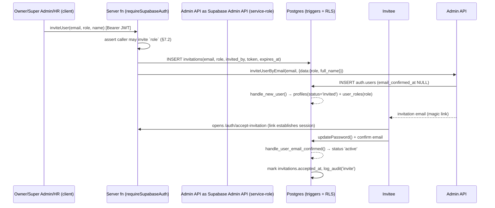

# SpartaFlow — Identity & Access Management (IAM) Architecture

> **Design document.** Describes the IAM architecture for SpartaFlow — a
> **closed, invitation-only** system. It is grounded in the code and schema that
> already exist (cited by file/function) and specifies the deltas needed to
> complete it. **No application code or migration is created or modified by this
> document.** Legend: ✅ exists today · 🆕 to add · 🔁 extend existing.
>
> Sources: `CLAUDE.md`, `docs/ARCHITECTURE.md` (§10–§12), `docs/DATABASE_DESIGN.md`
> (§1–§4, §18), `docs/AuditSystem.md`, `docs/RBAC.md`, and the live
> `supabase/migrations/`.
>
> _Snapshot date: 2026-07-02._

---

## 1. Principles

1. **Closed system.** There is no public registration. An account exists only
   because a privileged user invited it. Self-service sign-up is disabled at
   every layer (§4).
2. **Database is the source of truth.** Authorization is enforced by Postgres
   **RLS + `SECURITY DEFINER` helpers**. Every other layer (route guards, UI
   gating, the `permissions.ts` matrix) is a **mirror for UX**, never the only
   check (`ARCHITECTURE.md §12`).
3. **Defense in depth.** A request passes independent gates (§2); bypassing one
   (e.g. a hand-crafted API call) still hits RLS.
4. **Least privilege.** Default role is `employee`. Elevation is explicit,
   audited, and gated by who may grant which role (§7).
5. **Separation of identity, roles, and permissions.** Roles live in
   `user_roles` — **not** on `profiles` — so a profile self-update can never
   escalate privilege (`DATABASE_DESIGN.md §3`).
6. **Everything sensitive is audited.** Role grants, invites, sign-ins, and
   privileged mutations write an immutable trail (§10).
7. **The service-role key never reaches the client.** Privileged operations run
   server-side only (`client.server.ts`, `SECURITY DEFINER` RPCs) — §9.

---

## 2. Trust boundaries (defense in depth)

```
Browser (untrusted)
  │  session JWT in localStorage (Supabase client)
  ▼
┌─────────────────────────────────────────────────────────────┐
│ Layer 1 · Route guards (UX)      src/routes/_authenticated   │  redirect if unauthenticated/
│   authentication + role/perm gates in beforeLoad             │  unauthorized (not a security boundary)
├─────────────────────────────────────────────────────────────┤
│ Layer 2 · UI gating (UX)         useAuth() hasRole/hasPerm   │  hides controls; cosmetic only
├─────────────────────────────────────────────────────────────┤
│ Layer 3 · API authorization      requireSupabaseAuth mw      │  validates Bearer JWT, binds RLS client
│   (server functions)             + SECURITY DEFINER RPCs     │  for privileged writes
├─────────────────────────────────────────────────────────────┤
│ Layer 4 · RLS (AUTHORITATIVE)    Postgres policies +         │  the real enforcement — every table
│                                  has_role/has_permission     │  ENABLE ROW LEVEL SECURITY
└─────────────────────────────────────────────────────────────┘
```

Layers 1–2 are **UX** (fail closed, but a determined caller can skip them).
Layers 3–4 are **security**; Layer 4 (RLS) is the last line and always runs.

---

## 3. Identity model

```
auth.users (Supabase-managed)        ✅  — credentials, email, JWT issuer
   │ 1:1 (trigger handle_new_user)
   ▼
public.profiles                      ✅  — the "person" record + status
   │ 1:N
   ▼
public.user_roles (user_id, role)    ✅  — assigned app_role(s), separate table
   │            ▲
   │            │ role → permission(s)
public.role_permissions ─ permissions ✅ — the DB permission matrix (§6)
```

- **`auth.users`** — owned by Supabase Auth; issues the JWT (`sub` = user id).
- **`profiles`** — 1:1 with `auth.users`, auto-provisioned by
  `handle_new_user()` ✅. Carries `status employee_status` (§3.1).
- **`user_roles`** — `(user_id, role)` unique; a user may hold multiple roles.
  Written only by `owner`/`super_admin` (RLS `roles_admin_write`) ✅.

### 3.1 Account lifecycle (`employee_status`)

```
        invite (admin)            accept + confirm email
 (none) ───────────────► invited ─────────────────────► active
                                                          │
                                          suspend │       │ offboard
                                                  ▼       ▼
                                              suspended  offboarded
```

- `invited` — set by `handle_new_user()` when `email_confirmed_at IS NULL` ✅.
- `active` — flipped by `handle_user_email_confirmed()` on email confirmation ✅.
- `suspended` / `offboarded` — HR/admin transitions (🆕 lifecycle RPC, §7.3).
  Suspended/offboarded users retain rows (soft state) but must be denied access
  (§4.4). Directory reads already exclude non-active where appropriate
  (`profile_read_directory`).

---

## 4. Closed system — no public registration

Enforced at **four** independent layers so no single misconfiguration opens
sign-up:

| # | Layer | Mechanism | Status |
| --- | --- | --- | --- |
| 1 | **Supabase Auth config** | `[auth] enable_signup = false`; `enable_confirmations = true`. With signup disabled, only the **Admin API** (service-role) can create users. | 🆕 set in `supabase/config.toml` + hosted project settings |
| 2 | **No client API** | The app never calls `supabase.auth.signUp()`. `auth-service.ts` exposes only `signInWithPassword`, `signOut`, `requestPasswordReset`, `updatePassword`. | ✅ verified — zero `signUp` calls in `src/` |
| 3 | **No UI/route** | There is no `/auth/sign-up` route or component. `auth/` has only `index` (sign-in), `forgot-password`, `reset-password`, `accept-invitation`, `verify-email`, `session-expired`. | ✅ |
| 4 | **Graceful messaging** | If a signup path is ever hit, `mapAuthError` returns *"Self-signup is disabled. Ask your administrator for an invitation."* | ✅ (`features/auth/errors.ts`) |

**Why config matters most:** Layers 2–3 remove the *UI*, but the security
guarantee comes from Layer 1 — with `enable_signup = false`, a crafted request
to `/auth/v1/signup` is rejected by Supabase itself. Verify this in the hosted
dashboard as a release gate.

### 4.4 Access revocation for non-active accounts
Disabling sign-up is not enough — a `suspended`/`offboarded` user could still
hold a valid session. Enforce at the authoritative layer:
- **RLS predicate** 🆕: gate sensitive policies on `is_active(auth.uid())` — a
  `SECURITY DEFINER` helper returning `profiles.status = 'active'` — in addition
  to role checks.
- **Session invalidation** 🆕: the offboarding RPC calls the Admin API to sign
  the user out / ban the auth user so the refresh token stops working.

---

## 5. Bootstrap Owner account

**The chicken-and-egg problem:** `handle_new_user()` assigns `employee` by
default; only `owner`/`super_admin` may grant roles. So the *first* Owner cannot
be created by the normal in-app flow. Two grounded, safe options — use **A** for
provisioning, keep **B** as the idempotent guard:

### A. Provision via service-role Admin API (recommended)
The trigger already honors an invited role from user metadata:
```sql
-- handle_new_user() (existing):
invited_role := (NEW.raw_user_meta_data ->> 'role')::public.app_role;  -- ✅
INSERT INTO public.user_roles (user_id, role)
VALUES (NEW.id, COALESCE(invited_role, 'employee'));
```
So a one-time **server-side** script (service-role, never shipped) creates the
Owner:
```ts
// scripts/bootstrap-owner.ts  (design sketch — run once, service-role)
await admin.auth.admin.inviteUserByEmail(OWNER_EMAIL, {
  data: { role: "owner", full_name: OWNER_NAME },   // → trigger assigns 'owner'
});
```
The Owner receives the invitation email and sets a password via
`/auth/accept-invitation` like any invitee (§6).

### B. Idempotent, self-disabling `bootstrap_owner()` RPC (safety net) 🆕
A `SECURITY DEFINER` function that promotes a caller to Owner **only while no
Owner exists**, so it can never be used to escalate later:
```sql
CREATE FUNCTION public.bootstrap_owner()
RETURNS void LANGUAGE plpgsql SECURITY DEFINER SET search_path = public AS $$
BEGIN
  IF EXISTS (SELECT 1 FROM public.user_roles WHERE role = 'owner') THEN
    RAISE EXCEPTION 'An owner already exists';       -- self-disabling
  END IF;
  INSERT INTO public.user_roles (user_id, role)
  VALUES (auth.uid(), 'owner') ON CONFLICT DO NOTHING;
  PERFORM public.log_audit('role_grant','user_roles',auth.uid(),'bootstrap owner');
END; $$;
REVOKE EXECUTE ON FUNCTION public.bootstrap_owner() FROM anon;  -- authenticated only
```

**Rules:** exactly one Owner at bootstrap; the Owner is the only role that can
create `super_admin`; the bootstrap path is **audited** and must be verified
closed (`SELECT count(*) FROM user_roles WHERE role='owner'` = 1) post-setup.

---

## 6. Invitation-based onboarding

The only way an account comes into existence. All invite creation is
**server-side / service-role** — clients never create users.

### 6.1 Flow



### 6.2 What exists vs. what to add
| Piece | Status |
| --- | --- |
| `handle_new_user()` provisions profile + role from invite metadata | ✅ |
| `handle_user_email_confirmed()` flips `invited → active` | ✅ |
| `/auth/accept-invitation` route (set password, `noindex`, `ssr:false`) | ✅ |
| `/auth/verify-email`, `session-expired` routes | ✅ |
| `invite_user(email, role)` **server fn** wrapping the Admin API + guard | 🆕 |
| `invitations` **tracking table** (email, role, invited_by, token, expires_at, accepted_at, revoked_at) | 🆕 (`DATABASE_DESIGN.md §5` satellite) |
| Resend / revoke invitation, expiry (e.g. 7 days) | 🆕 |

### 6.3 `invitations` table (🆕 design)
Tracks invite state for the admin UI + audit; the auth user is still owned by
Supabase.
| Column | Type | Notes |
| --- | --- | --- |
| id | uuid PK | |
| email | citext NOT NULL | one open invite per email (partial unique WHERE accepted_at IS NULL AND revoked_at IS NULL) |
| role | app_role NOT NULL | role to grant on accept |
| invited_by | uuid | → auth.users SET NULL |
| status | text | pending / accepted / revoked / expired |
| expires_at | timestamptz | default now()+7d |
| accepted_at / revoked_at | timestamptz | |
| created_at | timestamptz | |

- **RLS**: insert/select/update by `owner`/`super_admin`/`hr` only; invitee
  never reads the table (they interact via the auth link).
- **Guard**: the `invite_user` server fn asserts the caller may grant the
  requested role (§7.2) **before** calling the Admin API.

---

## 7. RBAC

### 7.1 Roles (`app_role` enum ✅)
Ordered by `ROLE_RANK` (`features/auth/types.ts`):

| Role | Rank | Scope summary |
| --- | --- | --- |
| `owner` | 100 | Everything; only role that can mint `super_admin`; read-only on some ops (e.g. attendance). |
| `super_admin` | 90 | All except `owner:access`; manages roles/users/settings. |
| `hr` | 70 | People/HR: profiles, invitations, directory, reports read; **not** role grants. |
| `project_manager` | 60 | Project/portfolio management, report review. |
| `team_lead` | 50 | Team-level management, report review. |
| `employee` | 30 | Default. Own work, own reports. |
| `viewer` | 10 | Read-mostly. |

A user may hold **multiple** roles; effective permissions are the **union**
(`permissionsForRoles`, `has_permission`).

### 7.2 Who may grant which role (assignment matrix) 🆕 rule
Enforced in the `grant_role`/`invite_user` RPCs + `roles_admin_write` RLS:

| Granter | May grant |
| --- | --- |
| `owner` | any role (incl. `super_admin`, `owner`) |
| `super_admin` | any role **except** `owner` and `super_admin` |
| `hr` | `employee`, `viewer` (onboarding only) |
| everyone else | nothing |

**Invariants:** never remove the last `owner`; no self-elevation
(`granter ≠ target` for elevation, or an explicit allowlist); every grant/revoke
is audited (§10).

### 7.3 Role/lifecycle operations (privileged) 🆕
Expose as `SECURITY DEFINER` RPCs (not raw table writes) so guards + audit are
centralized: `grant_role(user, role)`, `revoke_role(user, role)`,
`suspend_user(user)`, `offboard_user(user)`. Each: assert caller authority →
mutate → `log_audit(...)` → (for suspend/offboard) invalidate session via Admin
API (§4.4).

### 7.4 Frontend mirror (UX only)
`AuthProvider` loads `roles` (`fetchRoles`) and precomputes the permission set;
`useAuth()` exposes `hasRole`, `hasAnyRole`, `hasPermission`, `hasAnyPermission`
(`ARCHITECTURE.md §7`). Granular helpers already exist in `permissions.ts`
(`canReviewReports`, `canAdministerAttendance`, `isAttendanceReadOnly`) and are
unit-tested as the business-rule contract. **These gate UI only.**

---

## 8. Permission matrix

**Single source of truth is the DB** (`permissions` + `role_permissions`),
mirrored by `features/auth/permissions.ts` for the UI. `has_permission(uid, key)`
✅ joins `user_roles → role_permissions → permissions`.

### 8.1 Current matrix (seeded in `20260630120000_hr_reference_and_permissions.sql` ✅ / `permissions.ts` ✅)

| Permission ↓ / Role → | owner | super_admin | hr | project_manager | team_lead | employee | viewer |
| --- | :-: | :-: | :-: | :-: | :-: | :-: | :-: |
| `users:read`    | ✅ | ✅ | ✅ | ✅ | ✅ | ✅ | ✅ |
| `users:write`   | ✅ | ✅ | ✅ | — | — | — | — |
| `roles:write`   | ✅ | ✅ | — | — | — | — | — |
| `hr:access`     | ✅ | ✅ | ✅ | — | — | — | — |
| `owner:access`  | ✅ | — | — | — | — | — | — |
| `reports:read`  | ✅ | ✅ | ✅ | ✅ | ✅ | — | ✅ |
| `reports:write` | ✅ | ✅ | — | ✅ | ✅ | ✅ | — |

> `DATABASE_DESIGN.md §4` reserves further keys (`projects:write`, `tasks:write`)
> in the `permission_key` enum for when those domains wire their write paths.

### 8.2 Drift prevention (DB ⇄ frontend)
The frontend matrix must never diverge from the DB (a documented audit risk).
Add a **parity test** 🆕 that asserts `permissions.ts` `ROLE_PERMISSIONS` equals
the seeded `role_permissions` rows (generate one from the other, or snapshot).
This is the guard `ARCHITECTURE.md §15.5` calls for. Wire it into the existing
Vitest `unit` project (`docs/TESTING.md`).

---

## 9. API authorization

### 9.1 Two enforced read/write paths
| Path | When | Enforcement |
| --- | --- | --- |
| **Direct client + RLS** | Ordinary CRUD scoped by the caller's own rows/roles | RLS policies (Layer 4). Client uses the anon/publishable key + user JWT; RLS sees `auth.uid()`. |
| **Server function** (`requireSupabaseAuth`) | Privileged / cross-row / multi-step logic (invites, role grants, exports, offboarding) | Middleware validates the Bearer JWT (`auth.getClaims`) and binds an **RLS-scoped** client `{ supabase, userId, claims }`. Privileged writes go through `SECURITY DEFINER` RPCs that re-check authority. |

`ARCHITECTURE.md §15.4` flags this choice as "to be decided"; the IAM rule is:
**anything that changes who-can-do-what (roles, invites, lifecycle) is a server
function, never a direct client write.**

### 9.2 The middleware (✅ `integrations/supabase/auth-middleware.ts`)
`requireSupabaseAuth`:
- rejects missing/`non-Bearer`/malformed tokens (`Unauthorized: …`);
- validates via `supabase.auth.getClaims(token)`; requires `claims.sub`;
- builds a per-request client that forwards the user's token, so **RLS applies**
  to everything the server fn does on the user's behalf.
Client side, `attachSupabaseAuth` ✅ attaches the session bearer to every
server-fn RPC (registered in `start.ts`).

### 9.3 Service-role boundary
- `client.server.ts` (service-role, **bypasses RLS**) is server-only, dynamically
  imported, never in the client bundle (`ARCHITECTURE.md §10`).
- Use it **only** inside server fns for operations that legitimately need to
  bypass RLS (Admin API invites, cross-tenant audit reads) — and re-assert
  authority in code first. Never expose it to a route the client can reach
  unauthenticated.

### 9.4 Privileged RPC contract (🆕)
`invite_user`, `grant_role`, `revoke_role`, `suspend_user`, `offboard_user`,
`bootstrap_owner`: all `SECURITY DEFINER`, `search_path = public`, **execute
revoked from `anon`**, granted to `authenticated`, and each begins with an
authority assertion (`has_any_role(...)` / assignment matrix §7.2) and ends with
`log_audit(...)`. This mirrors the established `start_work_session` pattern
(`DATABASE_DESIGN.md §Conventions`).

---

## 10. Route guards

Guards run in `beforeLoad`; they are **UX gates** (fail-closed redirects), not
the security boundary — RLS still enforces (§2).

### 10.1 Layers (✅ existing + 🆕 proposed)
| Guard | Where | Does |
| --- | --- | --- |
| **Authentication** ✅ | `_authenticated/route.tsx` `beforeLoad` | `supabase.auth.getUser()`; no user → `redirect('/auth?redirect=<href>')`. `ssr:false` (session in `localStorage`). |
| **Session freshness** ✅ | global query/mutation `onError` (`lib/errors`) | on session-expiry → `/auth/session-expired` (see `ERROR_HANDLING.md`). |
| **Role/permission** 🆕 | per-route `beforeLoad` on sensitive routes | assert role/permission; else `redirect('/unauthorized')`. |
| **Unauthorized surface** ✅ | `routes/unauthorized.tsx` | the landing page for a denied guard. |

### 10.2 Proposed guard helper (design sketch)
A small, reusable guard resolves the identity once (via a cached
`ensureIdentity` query — auth repository `getCurrentIdentity`) and asserts:
```ts
// design sketch — not applied
function requirePermission(perm: Permission) {
  return async () => {
    const id = await ensureIdentity();                 // { userId, roles }
    if (!id) throw redirect({ to: "/auth" });
    if (!permissionsForRoles(id.roles).has(perm))
      throw redirect({ to: "/unauthorized" });
  };
}
// e.g. HR area:
// beforeLoad: requirePermission("hr:access")
// Owner dashboard:
// beforeLoad: requirePermission("owner:access")
```
**Route → gate mapping** (🆕 to wire; `ARCHITECTURE.md §15.5`):

| Route (area) | Required |
| --- | --- |
| `/app/hr/*` | `hr:access` |
| `/app/executive`, owner dashboard | `owner:access` |
| `/app/**` (all in-app) | authenticated (✅) |
| role/user admin screens | `roles:write` / `users:write` |

> The guard re-derives permissions from `roles` client-side for redirect UX; the
> **same** permission is enforced by RLS/`has_permission` server-side. If the two
> ever disagree, RLS wins and the user sees an error, not data.

---

## 11. Audit logging

Satisfies CLAUDE.md Security ("Audit important actions") and `AuditSystem.md`.
Two cooperating sinks:

### 11.1 `audit_events` — immutable DB trail (🆕, `DATABASE_DESIGN.md §18`)
Append-only; **no UPDATE/DELETE grants**; written by `log_audit(...)`
`SECURITY DEFINER` helper called from privileged RPCs/triggers.

| Column | Notes |
| --- | --- |
| id, actor_id (→ auth.users SET NULL), action (`audit_action`), entity_type, entity_id, summary, diff jsonb, ip, user_agent, correlation_id, created_at |
- **RLS**: read `owner`/`super_admin`/`hr` only; no client writes.
- **Indexes**: `(entity_type, entity_id, created_at DESC)`, `(actor_id, …)`, `(action)`.

### 11.2 What IAM audits (minimum)
`login`, sign-out, failed sign-in (rate-limited), password change, `invite`
(create/accept/revoke), `role_grant` / `role_revoke`, user `suspend`/`offboard`,
`bootstrap_owner`, permission-matrix changes, privileged `export`. Each writes
**actor, action, target, before/after diff, correlation_id**.

### 11.3 App-side bridge (✅ available)
`src/lib/logging` already ships an `auditLog` service and correlation IDs
(`docs/LOGGING.md`). Server fns should:
1. call the `SECURITY DEFINER` write path (`log_audit`) — the durable record; and
2. emit `auditLog.record({...})` — structured observability with the same
   `correlation_id`, so logs/traces/audit rows join up (`AuditSystem.md §7`).

### 11.4 Tamper-evidence & retention
Append-only enforcement (grants + a `tg_prevent_audit_mutation` trigger);
retention ≥ 1 year (security events), longer for role/offboarding changes
(`AuditSystem.md §6, §8`). PII in `diff` respects redaction (`redact()` in
`lib/logging`).

---

## 12. Session & token lifecycle

- **Issuer**: Supabase Auth. Access JWT (short-lived) + refresh token in
  `localStorage`; `autoRefreshToken` + `persistSession` on (`client.ts`).
- **Propagation**: `attachSupabaseAuth` adds the bearer to server-fn calls;
  `requireSupabaseAuth` validates it.
- **Expiry**: a failed refresh or expired session is classified by `lib/errors`
  (`isSessionExpired`) → one-shot redirect to `/auth/session-expired`
  (`ERROR_HANDLING.md`).
- **Revocation** (🆕): suspend/offboard calls the Admin API to sign out / ban the
  auth user so refresh stops (§4.4). Password reset/rotation via
  `requestPasswordReset` + `updatePassword` (✅).

---

## 13. Threat model & anti-patterns

| Threat | Mitigation |
| --- | --- |
| Self-registration | signup disabled at 4 layers (§4); primary = Supabase config. |
| Privilege escalation via profile edit | roles live in `user_roles`, not `profiles`; `roles_admin_write` RLS (§3, §7). |
| Escalation via API (skip UI) | RLS + `SECURITY DEFINER` RPC authority checks (§9). |
| Frontend/DB matrix drift | DB is source of truth + parity test (§8.2). |
| Service-role key leakage | server-only client, never bundled; never in a client-reachable route (§9.3). |
| Orphaned access after offboarding | `is_active` RLS predicate + session invalidation (§4.4). |
| Last-owner lockout | invariant: never remove the last owner (§7.2). |
| Unaudited privileged action | every privileged RPC ends with `log_audit` (§9.4, §11). |
| Enumeration on sign-in | generic error copy via `mapAuthError` (§4). |

**Anti-patterns (forbidden):** trusting a route guard / `hasPermission()` as the
only check; writing `user_roles` directly from the client; embedding the
service-role key client-side; a permission check that reads `profiles.role`
(there is no such column — roles are relational); mutating `audit_events`.

---

## 14. Status summary & build order

**Already in place (✅):** `app_role` enum · `user_roles` (+ RLS
`roles_admin_write`) · `permissions` + `role_permissions` + seed ·
`has_role`/`has_any_role`/`current_user_roles`/`has_permission` (SECURITY
DEFINER, anon-revoked) · `handle_new_user` / `handle_user_email_confirmed`
triggers · `requireSupabaseAuth` + `attachSupabaseAuth` · `_authenticated`
auth guard · `unauthorized` + `accept-invitation` + `session-expired` routes ·
`permissions.ts` frontend mirror + `useAuth()` · `lib/logging` `auditLog`.

**To add (🆕), in order:**
1. **Close signup**: `enable_signup=false` in Supabase config (§4).
2. **Bootstrap Owner**: service-role invite + `bootstrap_owner()` guard (§5).
3. **Invitations**: `invite_user` server fn + `invitations` table + revoke/expiry (§6).
4. **Role/lifecycle RPCs**: `grant_role`/`revoke_role`/`suspend_user`/`offboard_user` with assignment matrix (§7).
5. **Audit**: `audit_events` + `log_audit()` + `tg_prevent_audit_mutation` (§11).
6. **Route gates**: `requirePermission` guard wired to HR/Owner/admin routes → `/unauthorized` (§10).
7. **Access revocation**: `is_active` RLS predicate + Admin-API session invalidation (§4.4).
8. **Drift guard**: DB ⇄ `permissions.ts` parity test (§8.2).

Each new table/RPC ships with `ENABLE ROW LEVEL SECURITY` + policies in the same
migration; regenerate `src/integrations/supabase/types.ts` afterward (never
hand-edit).

---

_This is a design document; no application code or migration was modified.
See `docs/DATABASE_DESIGN.md`, `docs/AuditSystem.md`, `docs/RBAC.md`, and
`docs/ARCHITECTURE.md` for the surrounding context._
